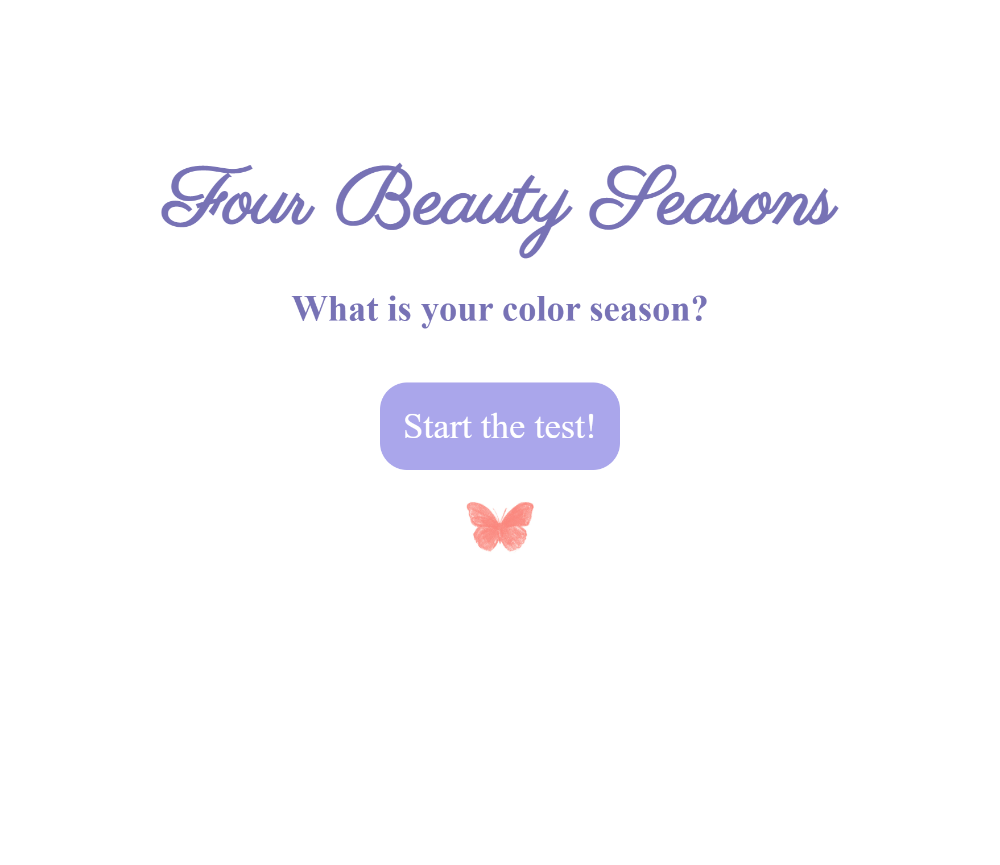

# Beauty App

React Beauty Four Seasons is an application that allows users to discover their color season, helping them understand which colors complement their natural features best. By taking a simple test within the app, users can answer a series of questions related to their skin tone, eye color, and hair color. The application then analyzes their responses and generates personalized results, revealing whether they belong to the spring, summer, autumn, or winter color season.
